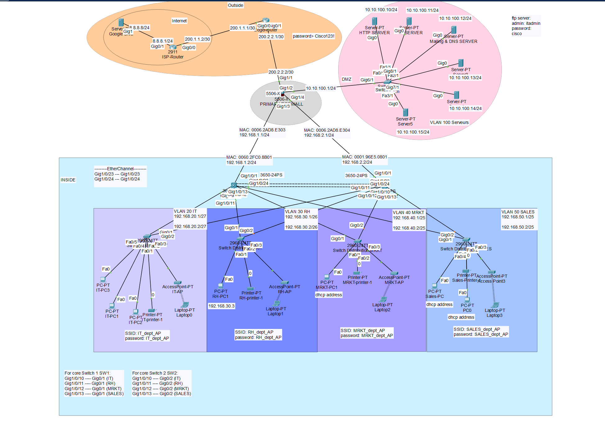

# 🏢 Conception et Implémentation d'un Réseau Local pour une PME avec Architecture Hiérarchique Sécurisée



---

## Projet réalisé au sein de l'ENSAM RABAT

### 👥 Équipe de Réalisation :

- **BAHLAOUI Ahmed**
- **LOGRAINE Wiam**
- **CHDAOUI Akram**
- **AZHAR Ilyass**
- **LAHLAOI Yasmine**
- **ENNACHKLAOUI Aya**
- **KHALLADY Kawtar**
- **MOUHSSINE Alae**

### 🎓 Filière : INDIA / SD

### 📚 Module : Réseaux locaux d'entreprises

### 📅 Année universitaire : 2025-2026


#### 📝 Description

Ce projet détaille la conception, la configuration et le déploiement d'une infrastructure réseau complète pour une PME. L'architecture repose sur un modèle **hiérarchique (Cœur/Distribution/Accès)** garantissant haute disponibilité, sécurité et évolutivité.

---

## 📑 Table des Matières

1.  [🌉 Architecture et Décisions de Conception](#-architecture-et-décisions-de-conception)
    1. [1. Modèle Hiérarchique Cisco](#1-modèle-hiérarchique-cisco)
    2. [2. Décisions Architecturales Clés](#2-décisions-architecturales-clés)
2.  [📊 Plan d'Adressage et VLANs](#-plan-dadressage-et-vlans)
3.  [🚀 Fonctionnalités Clés](#-fonctionnalités-clés)
    1. [🔄 Redondance (HSRP \& EtherChannel)](#-redondance-hsrp--etherchannel)
    2. [🛡️ Sécurité et Zones](#️-sécurité-et-zones)
    3. [📶 Connectivité Sans Fil](#-connectivité-sans-fil)
4.  [⚙️ Services et Protocoles](#️-services-et-protocoles)
    1. [Infrastructure](#infrastructure)
    2. [Serveurs (Hébergés en DMZ)](#serveurs-hébergés-en-dmz)
5.  [📂 Structure du Dépôt](#-structure-du-dépôt)

---

## 🌉 Architecture et Décisions de Conception

Nous avons opté pour une approche modulaire pour maximiser la robustesse du réseau.

### 1. Modèle Hiérarchique Cisco

- **Core Layer (Cœur) :** Deux commutateurs de niveau 3 (**Cisco 3650**) agissant comme l'épine dorsale du réseau. Ils gèrent le routage rapide entre les VLANs.
- **Distribution/Access Layer :** Des commutateurs dédiés pour chaque département (**IT, RH, Marketing, Ventes**) pour segmenter physiquement le trafic et limiter les domaines de diffusion.
- **Edge (Bordure) :** Un routeur et un pare-feu ASA pour sécuriser la sortie vers le WAN (Internet).

### 2. Décisions Architecturales Clés

- **Agrégation de Liens (EtherChannel) :** Nous avons configuré un **Port-Channel de niveau 3** entre les deux commutateurs de cœur. Cela permet de doubler la bande passante disponible et d'assurer qu'en cas de coupure d'un câble, le lien logique reste actif.
- **Séparation des Rôles DHCP :** Le **Core Switch** gère les adresses IP des employés (interne), tandis que le **Firewall ASA** gère l'adressage de la DMZ, isolant ainsi les processus critiques.
- **Sécurité par Zones :** Utilisation stricte du concept de zones (Inside vs DMZ vs Outside) sur le pare-feu ASA plutôt que de simples ACLs sur routeur.

---

## 📊 Plan d'Adressage et VLANs

Le réseau est segmenté logiquement pour optimiser la performance et la sécurité. L'adressage utilise **VLSM** pour éviter le gaspillage d'IPs.

| Département             | VLAN ID | Sous-réseau    | Masque | Passerelle Virtuelle (HSRP) |
| :---------------------- | :-----: | :------------- | :----: | :-------------------------- |
| **IT Support**          |  `20`   | `192.168.20.0` | `/27`  | `.30`                       |
| **Ressources Humaines** |  `30`   | `192.168.30.0` | `/26`  | `.62`                       |
| **Marketing**           |  `40`   | `192.168.40.0` | `/25`  | `.126`                      |
| **Ventes (Sales)**      |  `50`   | `192.168.50.0` | `/25`  | `.126`                      |
| **DMZ (Serveurs)**      |  `100`  | `10.10.100.0`  | `/24`  | `10.10.100.1` (ASA)         |

---

## 🚀 Fonctionnalités Clés

### 🔄 Redondance (HSRP & EtherChannel)

La continuité de service est notre priorité.

- **HSRP (Hot Standby Router Protocol) :**
  - **CoreSwitch1** est Actif (Priorité 150) et **CoreSwitch2** est en Standby.
  - Les PCs utilisent une **IP Virtuelle (VIP)**. Si CoreSwitch1 tombe en panne, CoreSwitch2 prend le relais automatiquement.
- **EtherChannel (LACP) :**
  - Les liens entre les Core Switches sont agrégés.
  - Augmente le débit et offre une tolérance aux pannes de câbles.

### 🛡️ Sécurité et Zones

- **Firewall Cisco ASA 5506-X :**
  - Inspection de paquets avec état (Stateful Inspection).
  - Politique de sécurité : **Trafic initié de l'intérieur autorisé**, trafic initié de l'extérieur bloqué (sauf exceptions).
- **Listes de Contrôle d'Accès (ACLs) :**
  - **DMZ :** Accessible depuis l'extérieur uniquement sur les ports 80 (HTTP) et 25 (SMTP).
  - **Management :** Seul le VLAN 20 (IT) peut initier des connexions SSH/FTP vers l'infrastructure.
- **SSH :** Activé sur tous les équipements pour le management sécurisé (clés RSA 1024 bits).

### 📶 Connectivité Sans Fil

- Points d'accès (AP) configurés dans chaque zone.
- Sécurisation **WPA2-PSK** pour empêcher les connexions non autorisées.
- Roaming transparent au sein du même VLAN.

---

## ⚙️ Services et Protocoles

### Infrastructure

- **Routage Inter-VLAN :** Assuré par les commutateurs Multicouches (SVI).
- **DHCP :**
  - Pools configurés avec exclusion des adresses statiques.
  - Option DNS propagée automatiquement aux clients.
- **DNS :** Serveur DNS interne (`10.10.100.12`) gérant la zone `corp.com`.

### Serveurs (Hébergés en DMZ)

1.  **Serveur Web :** `www.corp.com` (Simulé, accessible publiquement).
2.  **Serveur FTP :** `ftp.corp.com` (Stockage centralisé, accès sécurisé IT).
3.  **Serveur Email :** `mail.corp.com` (SMTP/POP3 pour la communication interne).

---

## 📂 Structure du Dépôt

Ce projet adopte une approche **Infrastructure as Code** pour le suivi des configurations.

```bash
.
├── cisco_projet_so_far_ver_1.0.5.pkt  # Fichier de simulation (Packet Tracer)
├── images/                            # Schémas et captures d'écran
├── configs/                           # Sauvegardes des configurations (Running Config)
│   ├── ASA_firewall.cfg               # Règles de sécurité et NAT
│   ├── core_router.cfg                # Configuration WAN
│   ├── core_switch1.cfg               # HSRP Actif, DHCP, EtherChannel
│   ├── core_switch2.cfg               # HSRP Standby, EtherChannel
│   ├── IT_distribution_switch.cfg     # VLANs et Sécurité de port
│   └── ...
└── README.md
```
